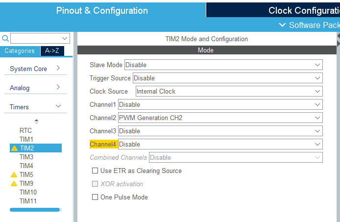

# STM32CubeIDE Servo Motor Control Using Nucleo-F446RE 

>Content in this module is referenced from Nizar Mohideen’s tutorials on MicroPeta. For more information, visit https://www.micropeta.com/video102

## Introduction
  This module covers wiring the servo, configuring a 50 Hz PWM signal, setting up the STM32CubeIDE environment, and coding to control servo positions from 0° to 180°. Ideal for integrating precise servo control in STM32 projects.

## Wiring Diagram
### Servo Motor Connections
- **Brown Wire**: Connect to ground.
- **Red Wire**: Connect to 5V power supply.
- **Orange Wire**: Connect to pin A1 on the Nucleo board.

    

## PWM Signal Explanation
### PWM Basics
- 50 Hz PWM signal: 50 pulses per second.
- Each pulse duration is 20 milliseconds (ms).

### Pulse Width for Servo Control
- 0° corresponds to a pulse width of 0.5 ms.
- 180° corresponds to a pulse width of 2.5 ms.
- Intermediate positions can be calculated proportionally.

### Calculating Pulse Widths
- Counter period for 20 ms (50 Hz signal).
- Calculation for 0°, 90°, and 180°:
  - 0° = 250 counts (1 ms pulse)
  - 90° = 750 counts (1.5 ms pulse)
  - 180° = 1250 counts (2.5 ms pulse)

### Example Calculation
- For 117°, interpolate the value:
  - 1° = $(1250 - 250) / 180 = 5.56$
  - Calculate for 117° : $250 + (117 \times 5.56) = 900$

## STM32CubeIDE Setup
### Project Creation
- Open STM32CubeIDE.
- Create a new project and select the STM32F446RE board.
- Name the project (e.g., "Servo") and finish the setup.

### Clock Configuration in STM32CubeMX
- Navigate to the clock configuration.
- Set the APB1 timer clock frequency to 180 MHz.
- Timer clock configured to 90 MHz.
  
        

### Timer Configuration
- Select Timer 2.
- Set the clock source to internal.
- Use Channel 2 for PWM generation.
  
- Assign pin PA1 for the PWM signal.
    

### Prescaler and Counter Period
- Set prescaler to `180-1` (to divide 180 MHz to 1 MHz).
- Set counter period to `10000-1` (to achieve 50 Hz signal).

    

## Code Implementation
### Accessing the Code
- Copy the provided code and paste it into the "USER CODE BEGIN 2" section.

    ```C
    /* USER CODE BEGIN 2 */
    HAL_TIM_PWM_Start(&htim2, TIM_CHANNEL_2);
    /* USER CODE END 2 */
    ```

### Main Loop Configuration
- In the main loop, configure PWM values for different angles (0°, 90°, 180°).

    ```C
    /* USER CODE BEGIN WHILE */
    while (1)
    {
        __HAL_TIM_SET_COMPARE(&htim2,TIM_CHANNEL_2, 250);
        HAL_Delay(1000);
        __HAL_TIM_SET_COMPARE(&htim2,TIM_CHANNEL_2, 750);
        HAL_Delay(1000);
        __HAL_TIM_SET_COMPARE(&htim2,TIM_CHANNEL_2, 1250);
        HAL_Delay(1000);
        /* USER CODE END WHILE */

        /* USER CODE BEGIN 3 */
    }
    /* USER CODE END 3 */
    ```

## Uploading and Testing
- Save the project configuration.
- Upload the code to the Nucleo board.
- Verify the servo motor responds to the PWM signals and moves to the specified angles.

## Conclusion
  - **Configured PWM**: Successfully configured Timer pin as PWM.
  - **Code Implementation**: Wrote code to control the servo.
  - **Project Deployment**: Compiled and flashed the code, verifying functionality.